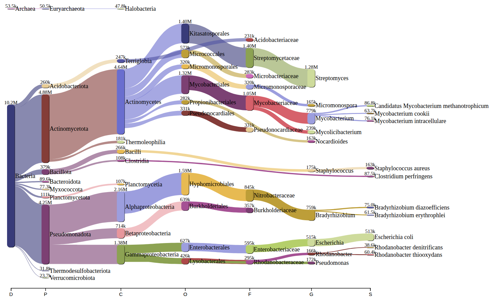

# soil-microagg
Workflow to analyze taxonomic abundance in soil microaggregates metagenomics data with the network analysis to study microbial communities and specific niches

# Getting Started
This is a workflow delineating the steps involved in getting the taxonomic abundance from metagenomics data followed by the calculating genome copies and visualizing the microbial community using Gephi software.

# Prerequisites
## Kraken2 
```
git clone https://github.com/DerrickWood/kraken2.git
```
Have to replace $KRAKEN2_DIR with the directory where you want to install in your computer 
```
./install_kraken2.sh $KRAKEN2_DIR 
cp $KRAKEN2_DIR/kraken2{,-build,-inspect} $HOME/bin
```
## Bracken
```
git clone https://github.com/jenniferlu717/Bracken.git
bash Bracken/install_bracken.sh
```
## Bowtie2
```
mamba create --name myenvname bowtie2
```
## samtools
```
wget http://www.htslib.org/download/samtools-1.18.tar.bz2
tar -xvjf samtools-1.18.tar.bz2
cd samtools-1.18/
./configure
make
make install
```
## NetworkX
```
pip install networkx
```
## [Gephi](https://gephi.org/users/download/) - For Network visualization

# Usage
Replace krakendb_folder with the folder name to be used as kraken database in your computer
```
sh kraken_build.sh krakendb_folder   ## Build kraken database
sh kraken_run.sh                ## Run script to generate braken report file
```

Upload braken report file at [Pavian](https://fbreitwieser.shinyapps.io/pavian/) browser. Pavian is a interactive browser application used for analyzing and visualization of assigned reads to each taxonomic level of all hierarchy. 

Here is an example depicting the results obtained from Pavian. The table shows the comparison between different samples (uploaded as the `_bracken_species.report`) for the number of reads assigned to different taxa, can be sorted as per the required hierarchy.


Another result obtained is Sankey plot to show the overview of each sample for all taxonomic hierarchy.



Here is an example, highlighting the steps involved in calculating the genome copies for each assigned taxa. To do so, in the beginning, a mixture containing an even copy number of genomic DNA from the three tagged strains [ATCC® MSA-1014™](https://www.atcc.org/products/msa-1014) was spiked in with the soil microaggregate sample. After that, Illumina sequencing reads were produced for the spiked-in sample.
The reads were then processed with the aforementioned kraken code and Pavian software.
Based on obtained result so far, we can calculate genome copies assigned to each taxa by using the equation, explained as below:
```
N = SP × TB/TR × GR/GB
```
**where**:
 - N = Genome copy number of an organism           
 - SP = Genome copy number of the spike-in tag
 - TB = Average size of 3 tags (820 bp)
 - TR = Number of total tag sequence reads
 - GR = Number of reads of an organism genome
 - GB = Organism genome size in bp

`SP` is the calculated genome copy of the spiked-in tag = Volume of spike-in tag added in sample(µL) × 6x10⁷/55

`TR` - run bowtie2 to generate sam file and then get the reads assigned to Escherichia, Clostridium, and Staphylococcus and sum it:
```
while IFS=" " read -r line1 line2; do bowtie2 -x ../../../yong_kraken/kraken2_result/quantitative_analysis/tagged_bact -1 $line1 -2 $line2 -S /media/mohini/Elements/absolute_quantity/vlad/QUO1008570/$(basename "$line1" | cut -d'_' -f1,2).sam --threads 20 ; done < in_files
```
To get the number of reads aligned with Escherichia, Clostridium, and Staphylococcus in sam file
```
samtools view -F 8 10F_S102.sam |grep -c 'Escherichia'
samtools view -F 8 10F_S102.sam |grep -c 'Clostridium'
samtools view -F 8 10F_S102.sam |grep -c 'Staphylococcus'
```

`GR` is the number of reads assigned to each hierarchy obtained from bracken report from pavian comparison table.

`GB` - Use python script mentioned below to fetch genome size of each taxa listed in the pavian comparison table
```
python scripts/genome_size.py in_file out_file
```
where in_file is the list of taxonomic Ids

